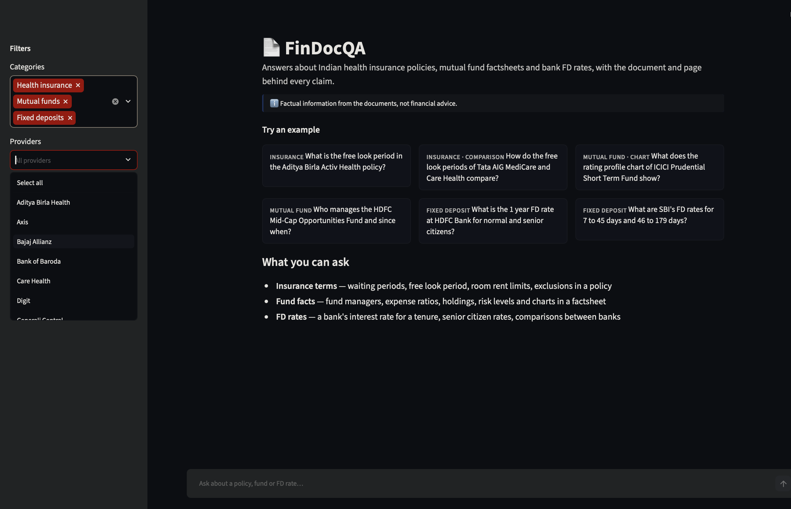
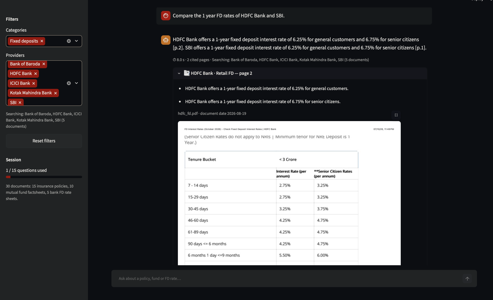
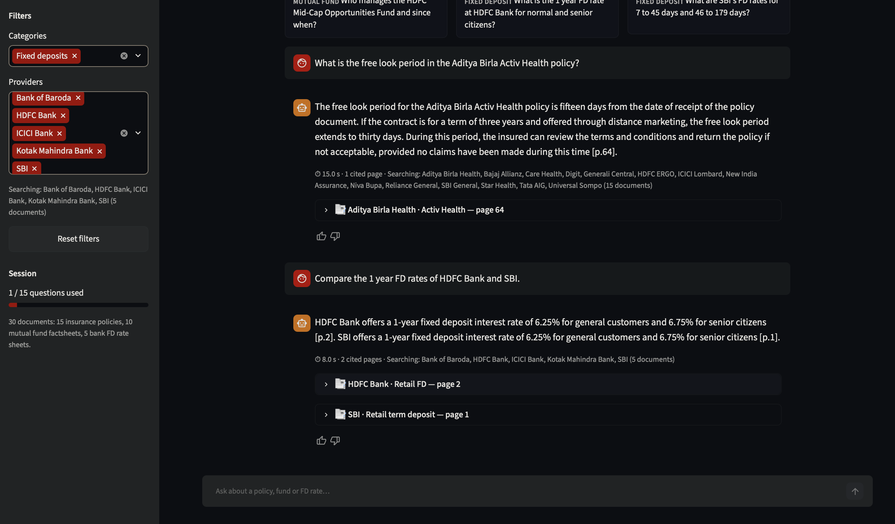
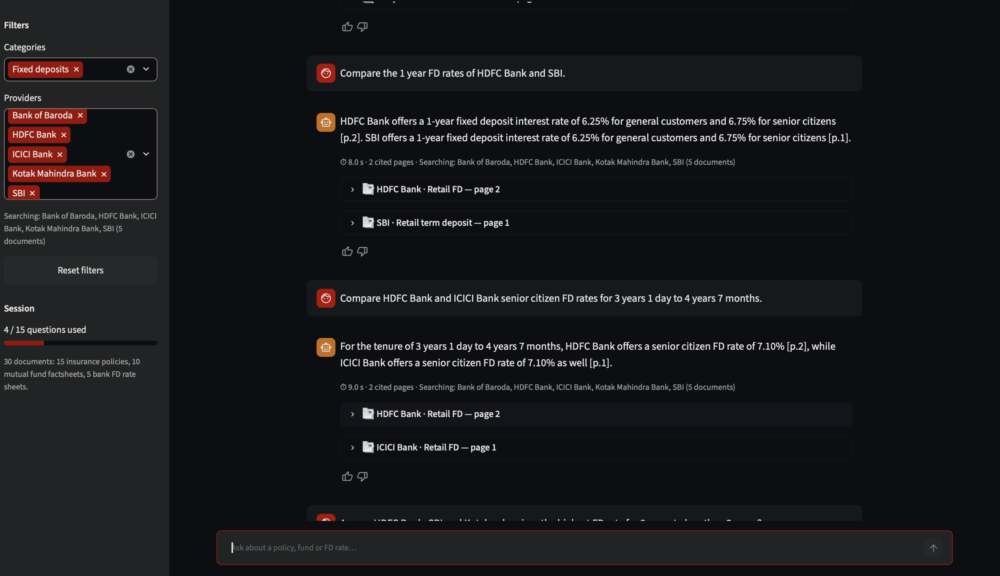
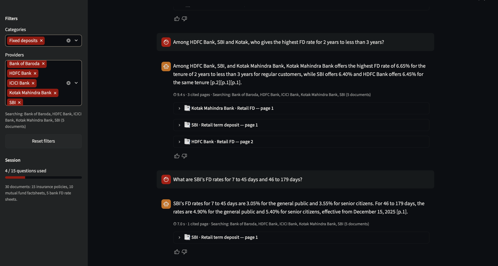
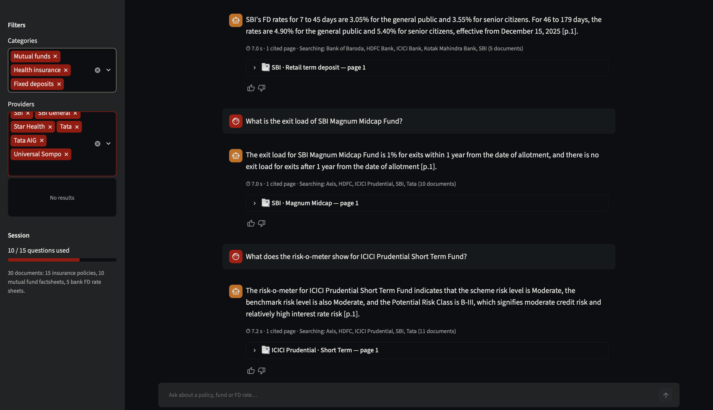
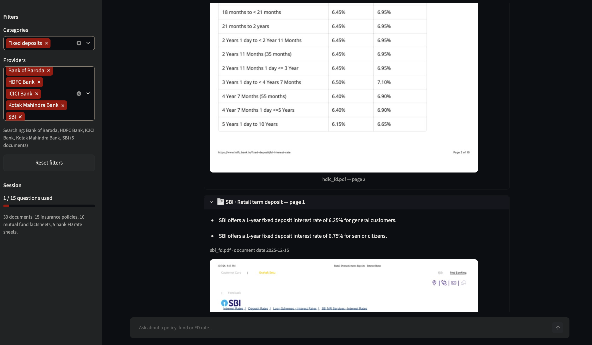
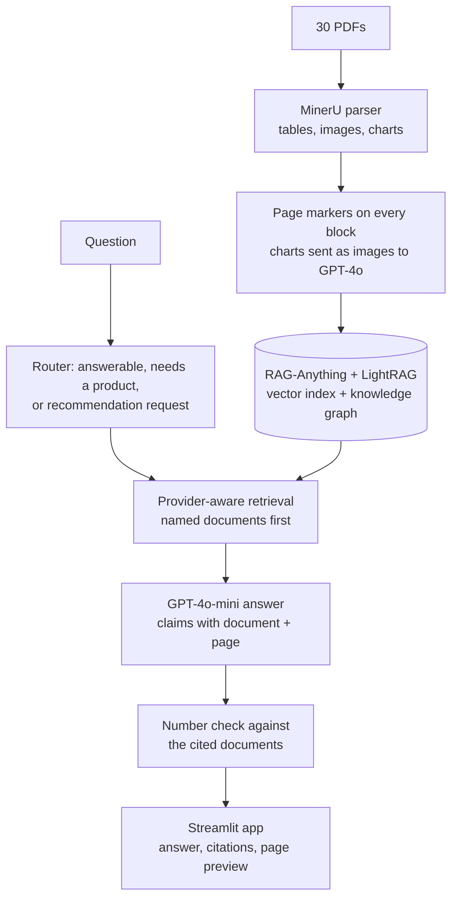

# FinDocQA

Ask questions about 30 Indian financial PDFs (health insurance policies, mutual fund factsheets and bank FD rate sheets).
Every answer shows the document and page each fact came from, with a preview of that page.


*Home screen: example questions, category and provider filters.*


*An answer with its citations; each card opens the cited PDF page.*


## Features

- **Page-level citations:** each claim in an answer names its document and page.
- **Tables and charts:** rate tables are parsed as tables, and charts are read by a vision model.
- **Provider-aware retrieval:** when a question names banks, insurers or funds, the search is limited to their documents, so comparisons don't mix them up.
- **Number check:** every figure in an answer must appear in the text of the document it cites; if half or more don't, the answer is withheld.
- **Streamlit UI:** category and provider filters, PDF page previews and thumbs-up/down feedback.

## Example questions

These are real answers from my evaluation runs, graded correct against the PDFs.

| Question | Answer | Cited |
|---|---|---|
| What is the HDFC Bank FD rate for 5 years 1 day to 10 years? | 6.15% for general customers, 6.65% for senior citizens | `hdfc_fd.pdf` p.2 |
| Which three stocks are the largest in the Axis Bluechip Fund's top 10 stocks chart? | Infosys 9.77%, Bajaj Finance 9.69%, ICICI Bank 9.09% | `axis_bluechip_largecap.pdf` p.16 |
| Among HDFC Bank, SBI and Kotak, who gives the highest FD rate for 2 years to less than 3 years? | Kotak 6.65%; HDFC Bank 6.45%; SBI 6.40% | `kotak_fd.pdf` p.1, `hdfc_fd.pdf` p.2, `sbi_fd.pdf` p.1 |

## More screenshots

| | |
|---|---|
|  |  |
| *A policy answer and an FD comparison, each with its cited pages.* | *Bank-to-bank FD comparisons with one citation per bank.* |
|  |  |
| *A three-bank comparison for one tenure, citing each rate sheet.* | *Mutual fund answers: exit load and riskometer level.* |


*The cited HDFC rate table in full, with the SBI citation below it.*

## Architecture



| Part | Tool |
|---|---|
| RAG framework | RAG-Anything 1.4.2, LightRAG 1.4.16 |
| PDF parsing | MinerU 3.4.5 |
| Charts and images | GPT-4o |
| Answers and routing | GPT-4o-mini |
| Embeddings | text-embedding-3-large |
| UI | Streamlit |

## Problems I solved

- **HDFC FD table losing rows:** my first print of the HDFC rate page parsed into 8 fragments and lost three tenure rows. A cleaner print gave one 19-row table, and I added a `reingest` command that replaces a document cleanly.
- **Insurers with identical wording:** IRDAI standard clauses look the same across 15 insurers, so a question about Tata AIG got other insurers' text. I now detect named providers and search only their documents.
- **Charts never read:** charts were captioned without the image ever reaching the vision model. Converting them to images lets GPT-4o read the numbers.
- **Made-up answers:** two prompt rules I added produced invented FD and tax tables. A "use only facts from the sources" rule and the number check fixed them.

## Results

- **70-query evaluation set:** 89.3% (first version: 73.6%). I used this set while building the system.
- **20-query unseen test:** run once after the last fix, 72.5%, with 93.3% citation accuracy.
- Answers were graded against the source PDFs (Y = 1, partial = 0.5, N = 0), with LLM assistance. The files are described in [`eval_files_guide.md`](eval_files_guide.md).

## Run it

Needs Python 3.10 and an OpenAI API key.

```bash
python3.10 -m venv venv310
source venv310/bin/activate
pip install -r requirements.txt
cp .env.example .env            # then set OPENAI_API_KEY in .env
```

The PDFs are not in the repo. Download them from the issuers' websites into `documents/insurance/`, `documents/mutual_funds/` and `documents/fixed_deposits/`, using the file names in [`documents/README.md`](documents/README.md).

```bash
python main.py ingest                 # parse and index the 30 PDFs (resumable)
python main.py extract-riskometers    # read fund risk levels from the factsheet pages
streamlit run app.py                  # open the web app
python main.py ask "What is the HDFC Bank FD rate for 5 years 1 day to 10 years?"
```

## Project structure

```
FinDocQA/
├── main.py                  # ingestion, retrieval, answering, number check, CLI
├── app.py                   # Streamlit app
├── run_eval.py              # runs a query file and saves the answers
├── dataset_manifest.csv     # the 30 documents with provider, product and date
├── documents/README.md      # which PDFs to download and where to put them
├── eval_files_guide.md      # what each evaluation file is
├── eval_queries.csv, new_test_queries.csv, held_out_queries.csv
├── eval_results_graded.csv, eval_results_v5_graded.csv, new_test_results_graded.csv
├── docs/screenshots/
├── requirements.txt
└── .env.example
```

Factual information from the documents, not financial advice.
